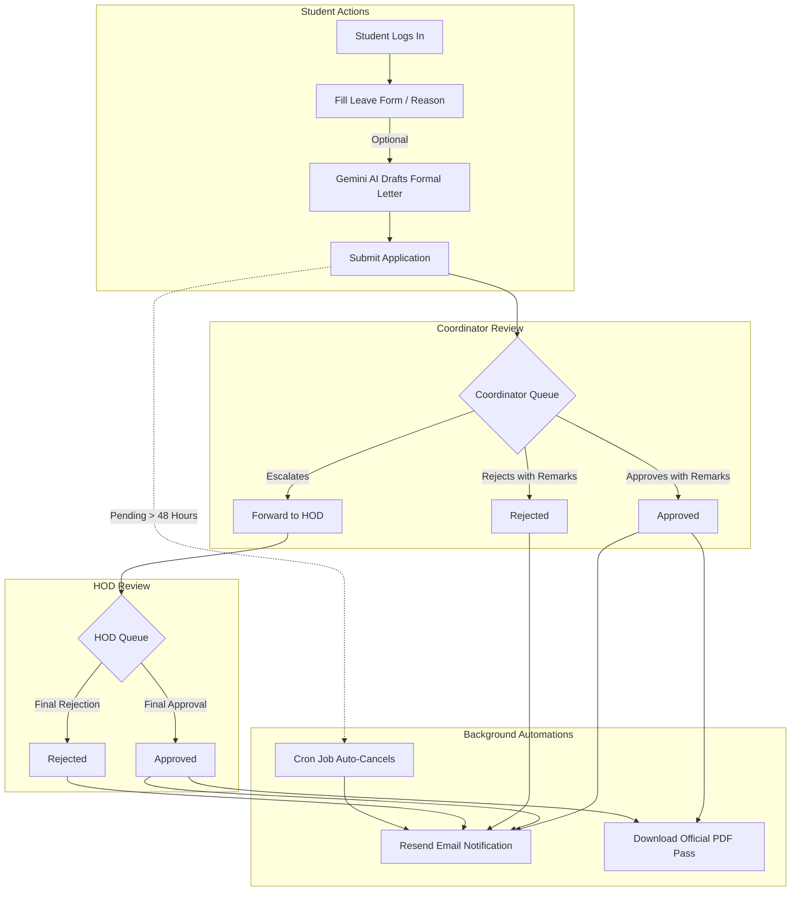

<div align="center">

# 📋 LeaveSync — Digital Leave Management System

> **A modern, intelligent, role-based leave management platform with AI-assisted drafting, transactional email notifications, automated cron auditing, and downloadable PDF certificates.**

---

### 🌐 Live Production Deployment

[](https://aileavesync.netlify.app)

**Frontend Application URL:** [https://aileavesync.netlify.app](https://aileavesync.netlify.app)  
**Backend API Status:** `Production Ready` *(Health Check: `/health`)*

---

[](https://nodejs.org/)
[](https://expressjs.com/)
[](https://react.dev/)
[](https://tailwindcss.com/)
[](https://www.mongodb.com/)
[](https://ai.google.dev/)
[](https://resend.com/)

</div>

---

## 📖 Table of Contents

- [Overview](#-overview)
- [System Architecture & Workflow](#-system-architecture--workflow)
- [Key Features](#-key-features)
  - [Student Portal](#1-student-portal)
  - [Coordinator Portal](#2-class-coordinator-portal)
  - [HOD Portal](#3-head-of-department-hod-portal)
  - [Automations & Integrations](#4-automations--integrations)
- [Tech Stack](#-tech-stack)
- [Project Directory Structure](#-project-directory-structure)
- [Getting Started & Local Setup](#-getting-started--local-setup)
  - [Prerequisites](#prerequisites)
  - [Backend Setup](#1-backend-setup)
  - [Frontend Setup](#2-frontend-setup)
- [Environment Variables](#-environment-variables)
- [API Endpoints Reference](#-api-endpoints-reference)
- [Database Models](#-database-models)
- [Security, Credentials & Route Protection](#-security-credentials--route-protection)
  - [Zero Credential Leak Guarantee](#1-zero-credential-leak-guarantee)
  - [Route Protection & RBAC Matrix](#2-route-protection--rbac-matrix)
  - [Production Hardening Checklist](#3-production-hardening-checklist)
- [Production Deployment](#-production-deployment)
- [License](#-license)

---

## 🌟 Overview

**LeaveSync** eliminates manual paperwork and chaotic email chains in educational institutions. It provides a structured, multi-tier approval hierarchy between **Students**, **Class Coordinators**, and the **Head of Department (HOD)**.

With built-in **Google Gemini AI**, students can draft formal, polished leave letters from brief notes in seconds. Coordinators enforce semester-wide leave policies and quotas, while an automated **cron job** prevents request backlogs by auto-cancelling unreviewed applications after 48 hours. Upon approval, students receive instant email notifications and an official, printable PDF leave pass with complete verification records.

---

## 🔄 System Architecture & Workflow



---

## ⚡ Key Features

### 1. Student Portal
- **Smart Application Submission**: Categorize leaves as *Medical*, *Important*, or *Less Important*.
- **AI-Powered Letter Generator**: Integrated with Google Gemini (`gemini-3.5-flash-lite`) to turn a one-line reason into a polite, professional, two-paragraph formal leave letter.
- **Leave Quota Indicator**: Real-time tracker showing used vs. maximum allowed leaves configured by the coordinator.
- **Status Tracking**: Visual progress badge indicators (*Pending*, *Forwarded*, *Approved*, *Rejected*, *Cancelled*).
- **Edit & Cancel**: Students can edit or retract pending leave applications before review.
- **One-Click PDF Export**: Download approved leave documents formatted as official letters complete with remarks, timestamps, and sanctioning officer details (`html2pdf.js`).

### 2. Class Coordinator Portal
- **Student Provisioning**: Create and manage student accounts assigned to their section.
- **Term Policy Enforcement**: Configure active academic periods (`durationFrom` to `durationTo`) and set the maximum leave quota allowed per student.
- **Triage Queue**: Review pending requests with options to **Approve**, **Reject**, or **Forward to HOD**.
- **Compulsory Remarks**: Ensures accountability by mandating justification comments before any status change.
- **Student History Inspection**: Search and audit the full leave trail of any student.

### 3. Head of Department (HOD) Portal
- **Master Admin Registration**: Initial bootstrap endpoint to establish departmental authority.
- **Coordinator Onboarding**: Create and delegate authority to class coordinators.
- **Escalated Queue Review**: Final decision-maker for sensitive or forwarded student applications.
- **Department-Wide Logs**: View student histories and track cross-cohort leave statistics.

### 4. Automations & Integrations
- 🤖 **Google Gemini AI (`@google/genai`)**: Zero-prompt-engineering leave letter synthesis without fill-in placeholders.
- ✉️ **Resend Transactional Emails**: Automated emails sent to students and staff upon submission, forward, decision, and auto-cancellation.
- ⏰ **Node-Cron Service**: Midnight background task (`0 0 * * *`) that checks for requests pending longer than 2 days, automatically cancels them, and alerts the applicant.

---

## 🛠️ Tech Stack

### Frontend
- **Framework**: [React 19](https://react.dev/) + [Vite](https://vitejs.dev/)
- **Styling**: [Tailwind CSS v4](https://tailwindcss.com/)
- **Routing**: [React Router DOM v7](https://reactrouter.com/)
- **Icons**: [Lucide React](https://lucide.dev/)
- **PDF Generation**: [html2pdf.js](https://ekoopmans.github.io/html2pdf.js/)
- **HTTP Client**: [Axios](https://axios-http.com/)
- **Date Utilities**: [date-fns](https://date-fns.org/)
- **Hosting**: [Netlify](https://www.netlify.com/)

### Backend
- **Runtime**: [Node.js](https://nodejs.org/) (CommonJS)
- **Framework**: [Express 5](https://expressjs.com/)
- **Database**: [MongoDB](https://www.mongodb.com/) with [Mongoose 9](https://mongoosejs.com/)
- **Authentication**: JSON Web Tokens ([jsonwebtoken](https://jwt.io/)) + [bcryptjs](https://github.com/dcodeIO/bcrypt.js)
- **AI Integration**: [@google/genai](https://www.npmjs.com/package/@google/genai)
- **Email Delivery**: [Resend](https://resend.com/)
- **Task Scheduling**: [node-cron](https://www.npmjs.com/package/node-cron)

---

## 📁 Project Directory Structure

```text
digital-leave-system/
├── backend/
│   ├── config/             # Database connection setup
│   ├── controllers/        # Business logic (authController, leaveController)
│   ├── middleware/         # Auth & role-based access verification
│   ├── models/             # Mongoose schemas (User, Leave)
│   ├── routes/             # Express API routes (authRoutes, leaveRoutes)
│   ├── services/           # External services (cronService, emailService)
│   ├── .env.example        # Backend environment template
│   ├── app.js              # Express app configuration & middleware
│   ├── package.json        # Backend dependencies & metadata
│   └── server.js           # HTTP server initialization & DB connector
│
├── frontend/
│   ├── public/             # Static public assets & _redirects for Netlify
│   ├── src/
│   │   ├── components/     # Protected route wrappers & common UI elements
│   │   ├── context/        # React AuthContext for state & token management
│   │   ├── pages/          # Login, Register, Dashboards (Student, Coord, HOD)
│   │   ├── utils/          # Axios instance & html2pdf generator logic
│   │   ├── App.jsx         # Client-side router configuration
│   │   └── main.jsx        # React DOM entry point
│   ├── .env.example        # Frontend environment template
│   ├── index.html          # Application HTML shell
│   ├── package.json        # Frontend dependencies
│   └── vite.config.js      # Vite build configuration
│
└── README.md               # Project documentation
```

---

## 🚀 Getting Started & Local Setup

### Prerequisites
Make sure you have installed:
- **Node.js**: `v18.x` or higher
- **npm**: `v9.x` or higher
- **MongoDB**: A running local instance or free [MongoDB Atlas](https://www.mongodb.com/atlas) cluster URI
- **Google Gemini API Key**: Obtainable from [Google AI Studio](https://aistudio.google.com/)
- **Resend API Key**: (Optional for emails) From [Resend.com](https://resend.com/)

---

### 1. Backend Setup

```bash
# Navigate to backend directory
cd backend

# Install dependencies
npm install

# Create environment file from template
cp .env.example .env
```

Configure your `backend/.env` file:
```env
PORT=3000
MONGO_URI=mongodb+srv://<username>:<password>@cluster.mongodb.net/leavesync
JWT_SECRET=your_jwt_secret_key_here
GEMINI_API_KEY=your_gemini_api_key_here
RESEND_API_KEY=your_resend_api_key_here
EMAIL_FROM=LeaveSync <onboarding@resend.dev>
```

Start the backend server:
```bash
node server.js
```
*Backend runs on `http://localhost:3000` with health check at `http://localhost:3000/health`.*

---

### 2. Frontend Setup

```bash
# Navigate to frontend directory
cd ../frontend

# Install dependencies
npm install

# Create environment file from template
cp .env.example .env
```

Configure your `frontend/.env` file:
```env
VITE_BASE_URL=http://localhost:3000/api
```

Launch development server:
```bash
npm run dev
```
*Frontend runs on `http://localhost:5173` (or port indicated by Vite).*

---

## 🔑 Environment Variables

### Backend (`backend/.env`)

| Variable | Required | Description | Example |
| :--- | :---: | :--- | :--- |
| `PORT` | Optional | Port for Express server (default: 3000) | `3000` |
| `MONGO_URI` | **Yes** | MongoDB connection string (Atlas or Local) | `mongodb+srv://...` |
| `JWT_SECRET` | **Yes** | Secret key for signing authorization tokens | `super_secure_jwt_random_key` |
| `GEMINI_API_KEY` | **Yes** | Google Gemini API key for AI letter generation | `AIzaSy...` |
| `RESEND_API_KEY` | Optional | API key for transactional email notifications | `re_...` |
| `EMAIL_FROM` | Optional | Verified sender address for Resend emails | `LeaveSync <onboarding@resend.dev>` |

### Frontend (`frontend/.env`)

| Variable | Required | Description | Example |
| :--- | :---: | :--- | :--- |
| `VITE_BASE_URL` | **Yes** | API endpoint base URL | `https://your-backend.onrender.com/api` |

---

## 🗄️ Database Models

### `User`
```javascript
{
  name: String,
  email: { type: String, unique: true },
  password: String (hashed with bcryptjs),
  role: { type: String, enum: ['HOD', 'Coordinator', 'Student'] },
  createdBy: ObjectId -> ref 'User',
  leavePolicy: {
    durationFrom: Date,
    durationTo: Date,
    maxLeaves: Number
  }
}
```

### `Leave`
```javascript
{
  studentId: ObjectId -> ref 'User',
  type: { type: String, enum: ['Medical', 'Important', 'Less Important'] },
  content: String,
  status: { type: String, enum: ['Pending', 'Forwarded', 'Approved', 'Rejected', 'Cancelled'], default: 'Pending' },
  attachmentUrl: String,
  comments: String,
  processedBy: String,
  processedAt: Date
}
```

---

## 🛡️ Security, Credentials & Route Protection

### 1. Zero Credential Leak Guarantee
- **Server-Side Isolation**: All sensitive credentials (`MONGO_URI`, `JWT_SECRET`, `GEMINI_API_KEY`, `RESEND_API_KEY`) run strictly inside the Node.js backend. They are **never packaged or exposed** in the frontend client build.
- **Client Bundle Safety**: The React application bundle hosted on Netlify only consumes `VITE_BASE_URL`. Authentication tokens are standard short-lived JWT strings transmitted over encrypted HTTPS headers (`Authorization: Bearer <token>`).
- **Git Hygiene**: Environment files (`.env`) are ignored via `.gitignore`. The repository only maintains sanitised `.env.example` templates with empty placeholders.

### 2. Route Protection & RBAC Matrix

Each route is guarded using double-layer Express middleware:
1. `protect`: Decodes and verifies the incoming Bearer JWT against `process.env.JWT_SECRET`.
2. `authorize(...roles)`: Validates that the authenticated user's role matches permitted roles.

| Route / Capability | Student | Class Coordinator | Head of Department (HOD) | Protection Rules |
| :--- | :---: | :---: | :---: | :--- |
| **Apply for Leave** | ✅ | ❌ | ❌ | Validates active policy quotas; ties `studentId` to verified token |
| **AI Letter Drafting** | ✅ | ❌ | ❌ | Prompt processed server-side via Gemini API; key remains hidden |
| **View Own Leaves** | ✅ | ❌ | ❌ | Scoped strictly to `studentId: req.user._id` (Anti-IDOR) |
| **Edit / Cancel Leave** | ✅ | ❌ | ❌ | Only permitted if `status === 'Pending'` and owner matches |
| **Create Students** | ❌ | ✅ | ❌ | Coordinators can strictly create `Student` roles |
| **Set Term Leave Quota** | ❌ | ✅ | ❌ | Coordinators set maximum limits for their student cohort |
| **Review Pending Queue** | ❌ | ✅ | ❌ | Coordinators only see students they personally created |
| **Forward Leave to HOD** | ❌ | ✅ | ❌ | Escalates sensitive applications to departmental authority |
| **Create Coordinators** | ❌ | ❌ | ✅ | HOD can strictly create `Coordinator` roles |
| **Review Forwarded Queue**| ❌ | ❌ | ✅ | HOD reviews escalated applications across coordinators |
| **Approve / Reject Action**| ❌ | ✅ | ✅ | Mandatory non-empty remarks audited with timestamp & actor |
| **Download PDF Pass** | ✅ | ✅ | ✅ | Client-side export formatted from authenticated records |

---

## 📄 License

This project is open source and available under the [ISC License](https://opensource.org/licenses/ISC).

---

<div align="center">
  <b>Developed for higher education and modern institutional administration.</b>
</div>
